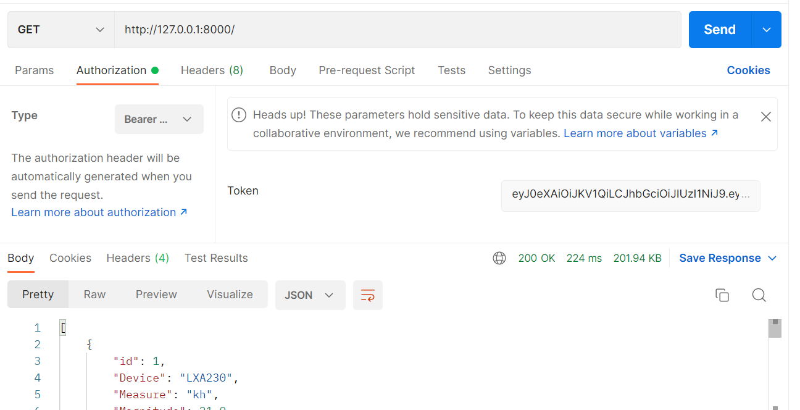

# Proyecto Python
Reto tecnico de microservicios

***_Ejecución del proyecto:_***

Para ejecutar el proyecto debemos seguir los siguientes pasos:
1. Descargar el repositorio
2. Deberemos instalar docker en caso de no tenerlo en nuestra maquina
3. Ejecutar el comando docker-compose up en la raiz de este proyecto
4. Automaticamente activará los contenedores necesarios para ejecutar el proyecto

**_Contenedores de docker y puertos_**
| servicio | contenedor docker| puerto |
| ------------- | ------------- | ------------- |
| Api simulador  | simulador | 3000 |
| Api intermediaria  | intermediate  |6000|
|Api del crud de medidas|crud| 8000 |
| base de datos postgres | bd | 5432 |

Cada uno de ellos se puede acceder de distinta manera y con los datos necesarios como se explica a continuación:

Api simulador

#### Para acceder mediante postman o alguna otra forma de consumo, se debe utilizar la petición ws ya  que el servicio es de tipo websocket
#### y tiene una contraseña por lo cual deberá enviarlo mediante un header de la siguiente manera:

1. el path de acceso es /metrics por lo cual su url debera quedar similar a la siguiente manera=

ws://127.0.0.1:3000/metrics

2. Para estar autorizado deberá enviar la credencial mediante los headers:

Authorization: 423B5DGH
Cabe recalcar que la contraseña fue dada por defecto pero puede ser cambiada en las variables de entorno
(asegurese de cambiarla también en la api intermediaria ya que esta la necesita para comunicarse)

variable de entorno api intermediaria : SECRET_WEBSOCKET

variable de entorno api simulador : SECRET_KEY

### imagen de referencia para su uso en postman

Api crud

 Este microservicio se encuentra alojado en la ruta http://127.0.0.1:8000
 puedes usar el path /docs para obtener mas información de este microservicio

 este servicio fue creado con el fin de administrar los datos guardados por el simulador por lo cual
 maneja un secreto para la seguridad jwt y un usuario con contraseña de administrador.

 para usuarios mas experimentados esto se puede modificar mediante docker pero para los usuarios mas basicos
 se proporcionará un usuario y una contraseña con el fin de poder manipular la información

 Pasos para utilizar el microservicio:
 1. Debes obtener el token del sistema en el path **/token** con las credenciales por defecto en los headers:

 username: admin
 password: admin123

 Estos valores se crean por defecto pero se pueden modificar cambiando las variables de entorno:
 SUPERADMIN , PSWD_ADMIN

 **hay que recalcar que al modificar esta información deberá cambiar las variables de entorno para la api intermediaria**
 los secretos son: SUPERADMIN , PSWD_ADMIN
 
 Mas no se puede modificar ingresandolo a la base de datos ya que el sistema codifica con una contraseña en formato jwt

 Una vez realizada la petición de tipo get te devolverá un token con el cual podrémos administrar la información

 **Imagen del consumo mediante postman**

Posteriormente este token lo necesitaremos para manejar la ruta de los datos, este en cada petición se debe enviar:
- Authorization
- Bearer token

Donde en bearer token se insertará el token y posteriormente se organiza el resto de la petición

**Ejemplo petición get all medidas con token**

Api intermediate

    Como la api intermediate no tiene puertos expuestos, para esta api se a configurado logs para ver
    las respuestas del consumo del crud al obtener la información, podemos acceder a ellos de la siguiente manera:

        docker logs intermediate
    
donde intermediate es el nombre del contenedor de docker, a esto le puedes agregar un until como aparece en la
documentación oficial para ver desde y hasta cierto punto en el tiempo

